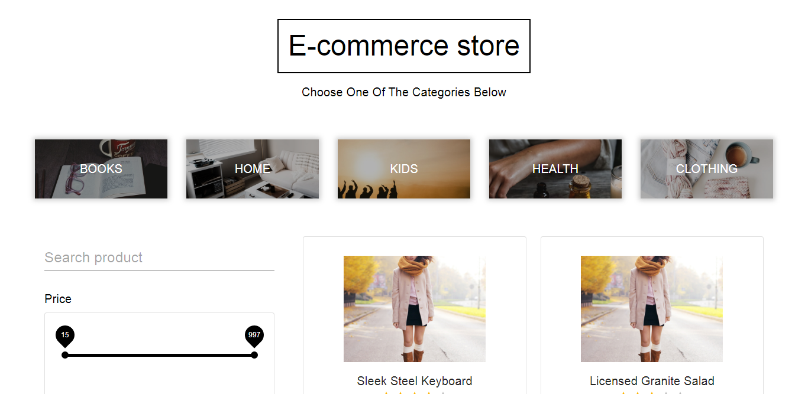

# Cataloge Front

## To run the application

**From the project directory**

1. run (npm install)
2. then run (npm start)

---

## The description of the problem and solution.

- The problem: we want the use to be able to see products in any category and filter the products based on things like (rating,color,price)

- The solution: build a single page application with react that will help us fetch the data fron the back end and display it dynamically to the user

## The type of the solution

- it was a front end solution

## Reasoning behind the technical choices, including architectural.

- I choose to make most of the state to be in the app component because all of the app compoenet`s children shared that state so putting it in app made it easy for the other components to communicate

## Trade-offs that were made, anything was left out

- being able to combine multiple filters (all filters works well on thier own)
